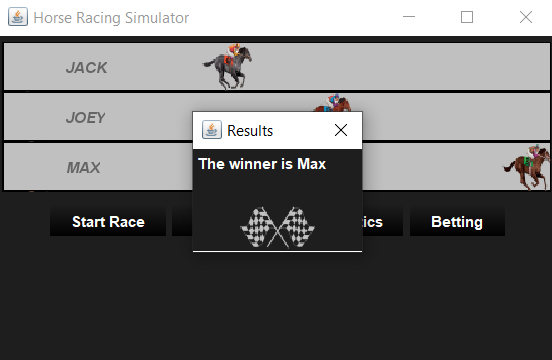
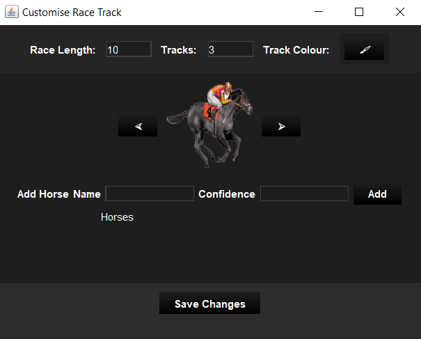
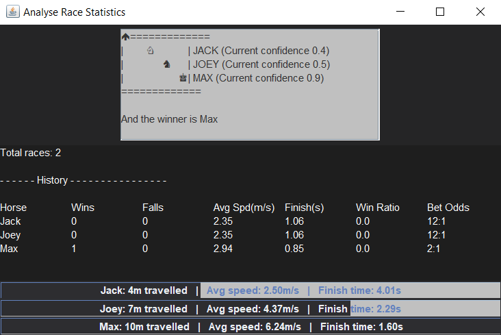
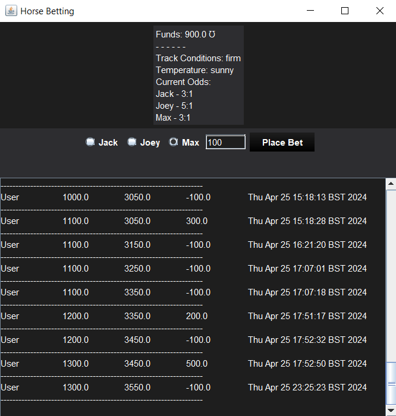
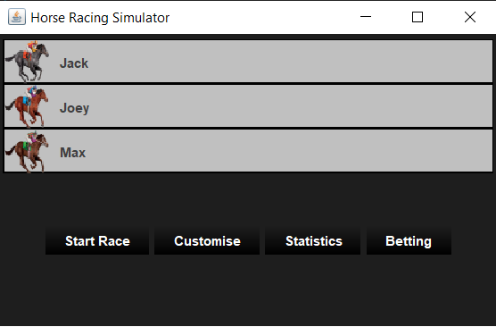
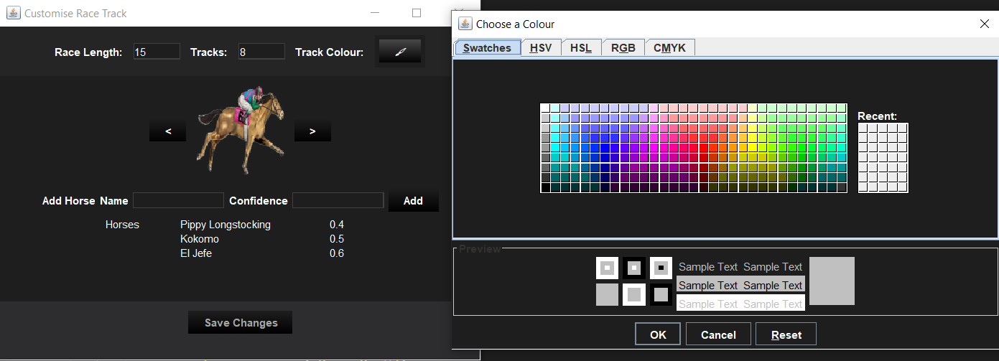
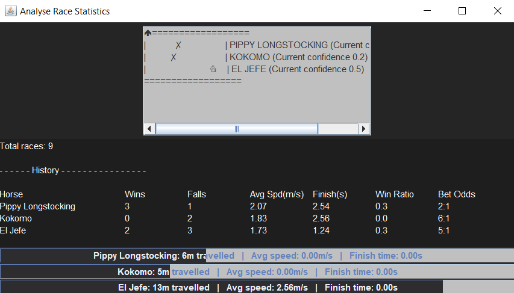
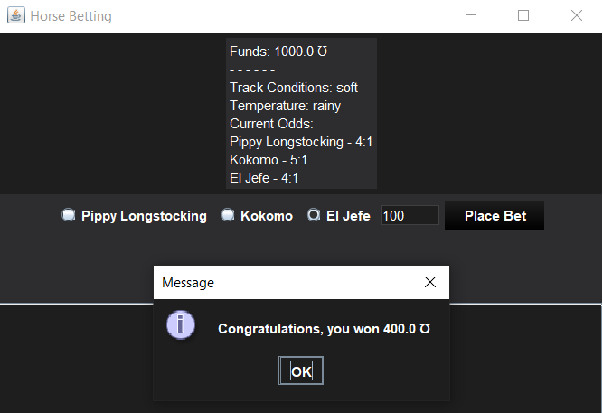

# HorseRaceSimulator

<!-- TABLE OF CONTENTS -->
<details>
  <summary>Table of Contents</summary>
  <ol>
    <li><a href="#about-the-project">About The Project</a></li>
    <li><a href="#set-up">Set Up</a>
      <ul>
        <li><a href="#dependencies">Dependencies</a></li>
        <li><a href="#gui-installation">GUI Installation</a></li>
        <li><a href="#alternative-installation-of-zip">Zip Alternative Installation</a></li>
      </ul>
    </li>
    <li><a href="#usage-guidelines">Usage Guidelines</a></li>
    <li><a href="#contact">Contact</a></li>
  </ol>
</details>


<!-- ABOUT THE PROJECT -->
## About The Project










Horse Race Simulator project, consisting of part 1 (textual race simulator) and part 2 (GUI development). Part 1 includes the Horse class and the modified Race class, along with documentation. Part 2 includes all GUI-related classes providing a user-friendly interface that expands on part 1.

The Horse Race Simulator application is an app that allows users to simulate horse races. Users can customise the track length, lanes, track colour, and customise horses to tailor the race to their preferences. Users may also view statistics which shows both historical data and real-time performance metrics during races. Additionally, a mini textual display is visible in the statistics window, showing the confidence levels pertaining to each horse in the race. The betting window allows users to place bets using a virtual currency, horseshoes Ʊ. Users start with a balance of 1000 Ʊ and may place bets upwards of 50 Ʊ. To inform users of track conditions and the latest betting odds for each horse, users can turn to a mini panel at the top of the bets window. Losing bets results in receiving helpful advice about placing future bets. To enhance the overall user experience, the application has a default dark theme and custom buttons.

<!-- SETTING UP -->
## Set Up

1. **Operating System**:
   - Windows
   - MacOS

The UI is optimised for windows computers so there may be some layout differences due to the core OS. However, the application is designed to be compatible with both.

2. **System Requirements**:
   - Java Development Kit (JDK) build version 16
   - Java Runtime Environment (JRE) build version 16
  
## Dependencies
This application requires no additional dependencies, relying solely on those provided in the JDK and JRE.

## GUI Installation

1. Clone the repository
   ```sh
   git clone https://github.com/Pie-R-Squared/HorseRaceSimulator.git
   ```
2. Navigate to project directory
   ```sh
   cd HorseRaceSimulator
   ```
3. Compile the GUI class
   ```sh
   javac HorseRaceSimulatorGUI.java
   ```
4. Run the application
   ```sh
   java HorseRaceSimulatorGUI
   ```

## Alternative Installation of Zip

1. Download the zip file from the repository

<image src="assets/projectZipDownload.png" alt="zip" width="300"/>

Download size: approx. 5MB

2. Go to the Downloads folder and extract the file

3. Open the terminal and locate the file
   ```sh
   cd Downloads\HorseRaceSimulatorGUI-main\part2
   ```
4. Compile the GUI class
   ```sh
   javac HorseRaceSimulatorGUI.java
   ```
5. Run the application
   ```sh
   java HorseRaceSimulatorGUI
   ```


<!-- USAGE EXAMPLES -->
## Usage Guidelines


After running the application, initiate the race by clicking on the 'Start Race' button. This image portrays the main screen of the application, and closing this will close all other open windows and terminate the app. A series of buttons open extra windows, but attempting to click a button twice just closes and reopens the corresponding window. In this window, users can watch the race and navigate to other windows. The race track is customisable and the window can be resized to fit users' needs. Upon changing the racelength or number of tracks, the window will automatically resize to accommodate the race panel. Once a race concludes the winner(s) is displayed in a dialog box, which can be cleared by setting customisations, starting another race or by simply pressing the 'x' to close the dialog window.



The 'Customise' button opens a new window allowing you to specify custom racelength and number of tracks. Track colour can be selected by clicking the button with the paintbrush icon, which opens a colour select panel. Below this, users can select from a number of different horse breeds, coat colours and associated accessories of each horse. Additionally, users can choose to set a name and confidence level for a horse then add it to the race. To select a particular horse, navigate through the image slider and stop on the desired image, then type in the name and confidence level and press the add button. Added horses are displayed in the below panel. Note that upon reopening the customisations interface, horses will be reset but race length, number of tracks and track colour will be saved. A default set of three horses (Jack, Joey and Max) will be applied by default. When adding more horses, these will replace the default set. Attempting to add more horses than the specified tracks will automatically create more tracks for the horses, up to a limit of 14. Adding less horses than the specified tracks will fill vacant lanes with unnamed horses and randomised horse colours. Pressing save without adding horses will add the default set of horses to the track.

Users must press 'Save' to apply the customisations. To ensure this is not forgotten, the button will be highlighted upon making a change. Racelength is limited to between 2 and 30 metres, while tracks are limited to between 2 and 14, inclusive. This is to prevent performance issues from having a large number of tracks on screen at once. Additionally, horse names can only contain alphabetic characters including space separators, with a character limit of 18. Confidence levels are limited to 0.1 to 0.9 inclusive.

Note, when a race has started, the customisations button will not work. This is to prevent users from trying to change the customisations mid-race. They are available before the race starts and after it ends, but not during it.

Updates to the betting window will occur as the customisations are saved, as they will for the statistics window. However, new horses won't have a history displayed in the history panel of the statistics window, until they compete in atleast one race. Once a race starts, the added horses' metrics will still appear on progress bars in the window.



The 'Statistics' button opens a window displaying a textual view of the race along with confidence levels of each horse. The past performance of horses are also displayed. Note, adding a new horse means they won't be displayed with a history until they have partaken in at least one race. The history shows metrics such as wins, falls, average speed, average finish times and win ratio across races. It also displays the previous betting odds, which is independent of track conditions but accounts for all performance metrics. When a race is started, progress bars indicate distance travelled by the horse as a percentage of the total distance, accompanied by average speed during the race and finish times (when the race ends). The current betting odds which account for track conditions can be found in the betting window.



For a more accurate and dynamic display of the betting odds, which includes track conditions and metrics, the betting window is available. Track conditions are listed at the top, below the current balance. The user has a default balance of 1000 Ʊ (horseshoes, a virtual currency), which they can use to bet on races. Betting has limitations so that it may not exceed the current balance and must be above 50 Ʊ. Error checking is implemented in all input fields so users cannot enter non-numerical data into them where required.

A set of radio buttons allow users to select a horse and specify an amount. Users can only specify amounts within their funds. A bet of 0 doesn't warrant a valid bet, so no changes are made. After selecting a horse and typing a valid amount, press the 'Place Bet' button. Users are advised that once they place a bet, to not attempt to place a bet on another horse. Doing so results in balance being deducted multiple times but the bet being placed on only the latest horse. Good conditions don't affect the odds, medium conditions add 1 to the odds and bad conditions add more to the odds. The higher the odds, the less likely the horse is to win the race.


<!-- CONTACT -->
## Contact

Aneeka Ahmad - ahmadaneeka@outlook.com

Project Link: [https://github.com/Pie-R-Squared/HorseRaceSimulator](https://github.com/Pie-R-Squared/HorseRaceSimulator)